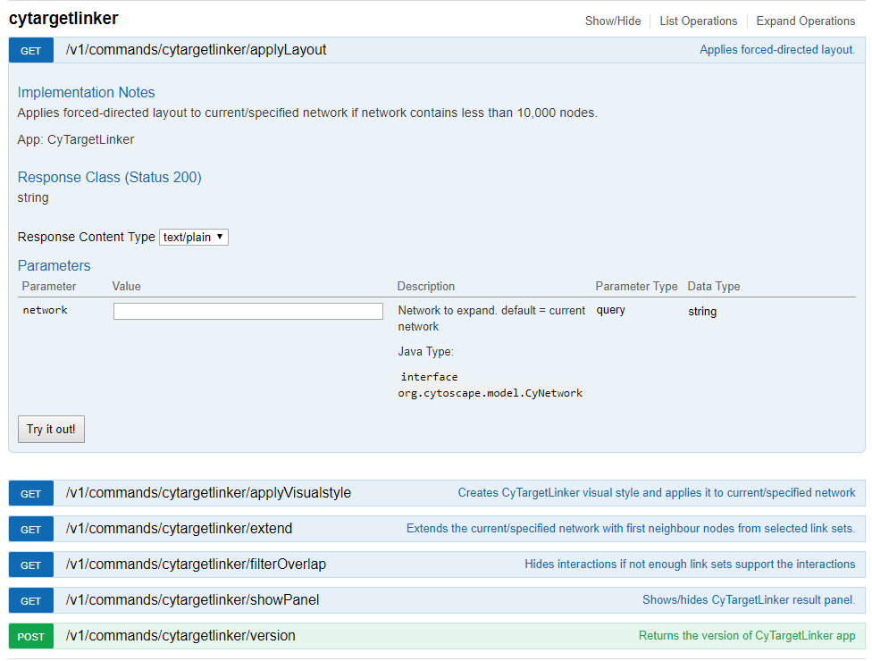

CyTargetLinker provides the following API functions:
```
applyLayout (applies force-directed layout)
applyVisualStyle (creates CyTargetLinker visual style and applies it to current/specified network)
extend (extends the current/specified network with first neighbour nodes from selected link sets)
filterOverlap (hides interactions if not enough link sets support the interaction)
showPanel (shows/hides CyTargetLinker result panel)
version (returns the version of CyTargetLinker app)
```

When Cytoscape is running and you have the CyTargetLinker app installed, you can check the Swagger documentation by going to

```
Help -> Automation -> CyREST Command API
```

If you go to the cytargetlinker section, you can expand each function and retrieve detailed documentation on the function and its parameters. The swagger documentation will always provide the current up-to-date documentation for the app version that you have installed.

Screenshot of the swagger API:


