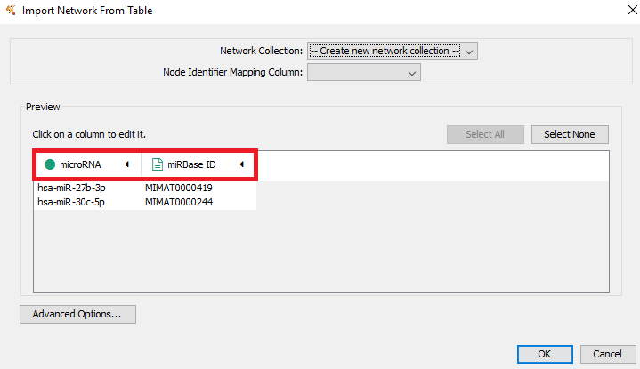
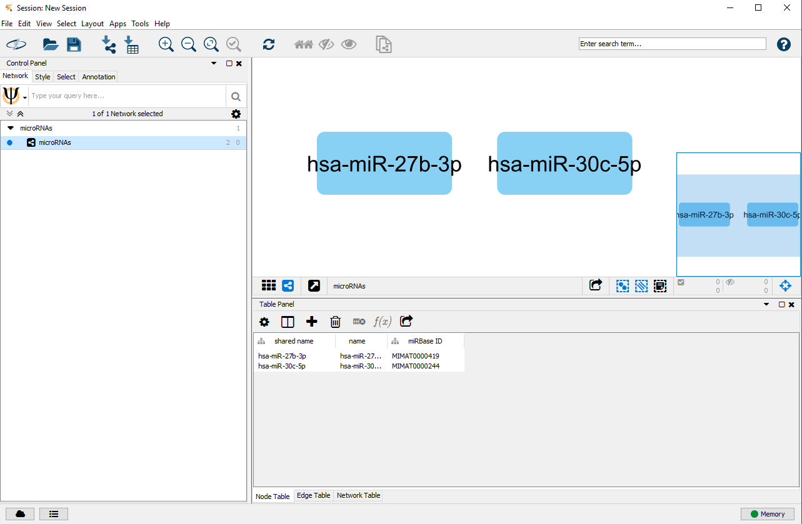
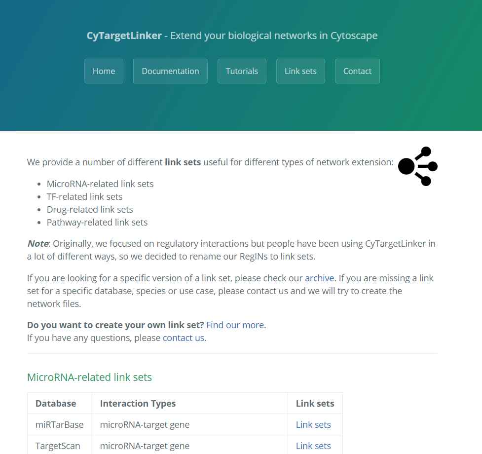
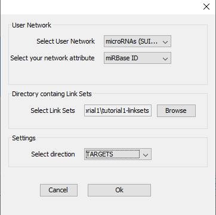
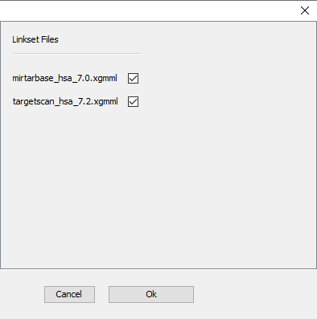
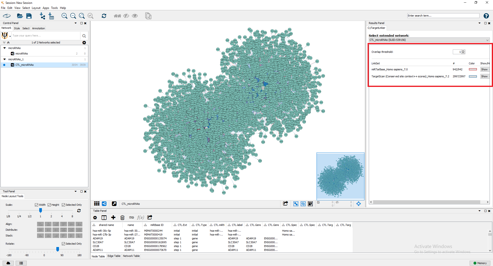
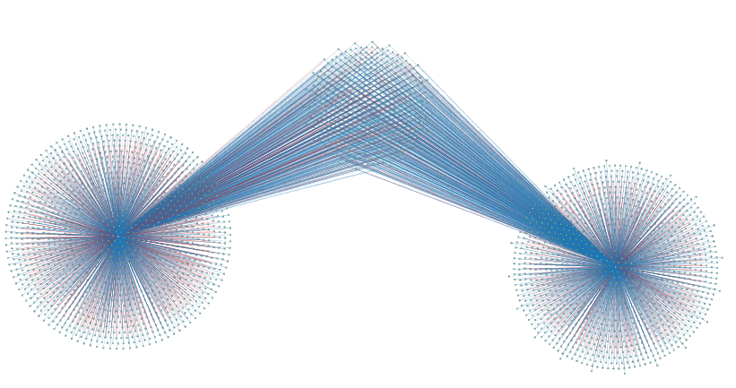
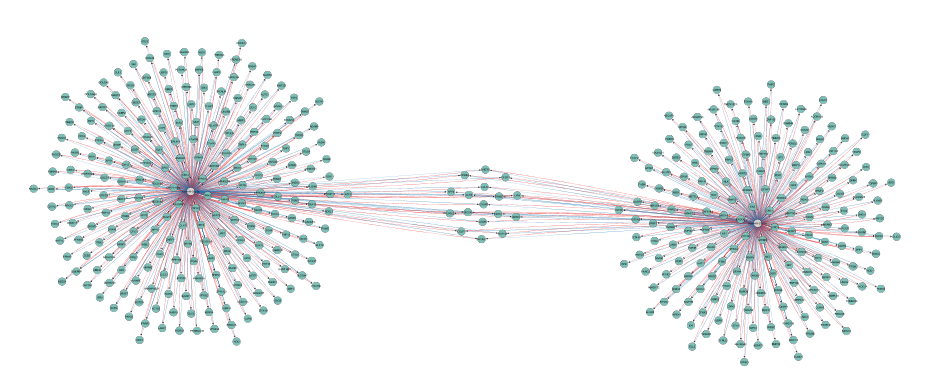

# Tutorial 1
## Extend a set of microRNAs with target information

CyTargetLinker provides a quick and extensive enrichment of networks in Cytoscape. The visualization options allow biological interpretation of complex regulatory networks in a graphical way.

In this tutorial, a step-by-step explanation is given on how to extend a list of microRNAs with predicted and validated microRNA-target interactions (MTIs).
The tutorial was created for the following versions:
* Cytoscape v3.7.1 
* CyTargetLinker app v4.1.0

-----

## Step 1: Import a set of microRNAs into Cytoscape

First you will need to create a biological network in Cytoscape containing your microRNAs of interest. The datafile should contain at least two columns, (i) the microRNA name and (ii) the corresponding miRBase accession number. 
An example datafile, in which two microRNAs known to be involved in obesity are listed, can be downloaded from here (microRNA.xlsx). 

* Open the datafile containing the microRNAs in Cytoscape via **File -> Import -> Network from File**. Select the downloaded microRNA.xlsx file.
* Specify the **microRNA** column as the **Source Node** (click on header and select green circle) and the **miRBase ID** as a **Source Node Attribute** (green data sheet), as shown in Figure 1. 
* After clicking **'OK'**, you will receive the following warning: "No edges will be created in the network; the source column is not selected. Do you want to continue?". Click **'Yes'**.

The resulting biological network of two microRNAs from the example data, as shown in Figure 2.

-----

## Step 2: Download MTI link sets
A link set is a network containing additional information and links about nodes in the network. This could be regulatory interactions like microRNA-gene interactions. The networks are stored in **XGMML** (the eXtensible Graph Markup and Modeling Language) format, which is supported by Cytoscape. Each link set contains interactions consisting of two nodes, source and target, connected through one directed edge. Several link set for different use cases, species and interaction types are **provided on our [website](https://cytargetlinker.github.io/pages/linksets)**, see Figure 3. CyTargetLinker is not limited to the provided link sets. A user can also easily create their own link sets.

Before starting CyTargetLinker you need to **download the link sets of interest** and store them in a **directory**. In this example, we will use microRNA-gene interaction link sets from miRTarBase (validated interactions) and TargetScan (predicted interactions). For this tutorial, you can download a zip file containing both link sets from here. 
* Download the zip file and unzip it so both xgmml files are in the **tutorial1-linksets directory**. 

-----

## Step 3: Built regulatory network in Cytoscape

* **Install the CyTargetLinker app** via the app manager (Apps -> App Manager -> Select CyTargetLinker -> Click 'Install').
* Let's start adding the known targets of the two microRNAs of interest.
* Go to **'Apps -> CyTargetLinker -> Extend network'** (see Figure 4)
* Select the correct elements in the drop-down boxes for **user network and network attribute**. The user network is the network you want to extend. The network attribute is the column that is used to identify the entities in the link set and needs to contain one of the supported identifiers. The MTI link sets support miRBase accession IDs, so we can select the miRBase ID column. 
* Browse to the downloaded **tutorial1-linksets directory** to select the link sets used for extension. 
* Select **'TARGET'** as direction, indiciating that you want to add target genes from the current microRNA nodes.

After clicking 'OK', you can select which of the link sets in the folder should be used - in this tutorial, we will use both available link sets in one extension step (Figure 5).

After the extension (this might take a littel while depending on the size of the original network and link sets), the extended network is visualized in a new Cytoscape network, as shown in Figure 6. Go to **'Apps -> CyTargetLinker -> Show result panel'** to see how many interactions are added from which link set. For the current extension 942 edges from miRTarBase and 2,997 from TargetScan where added. The edge color indicates from which link set the interaction was added (red for miRTarBase and blue for TargetScan).

Since the default layout (forced-directed) is not ideal for this specific extended network, you can try other layouts (e.g. the yFiles organic layout, see Figure 7). This gives you a better idea about how many shared targets the two microRNAs have.

-----

## Step 4: Adapt visualization options

At any point can you hide certain link sets by using the **'Show/Hide'** dropdown box in the results panel. You can also change the **edge color** used for a specific link set in this panel.

A very useful feature for large networks with multiple link sets containing the same interaction type, you can use the **'Overlap threshold' functionality**. If you select '2', then you will only see those interactions that are present in at least two link sets.
If you try this in the tutorial network, you will only see 454 microRNA-gene relationships (two edges between each of them – from each database one, see Figure 8). Those interactions are the only ones that are present in both databases.

